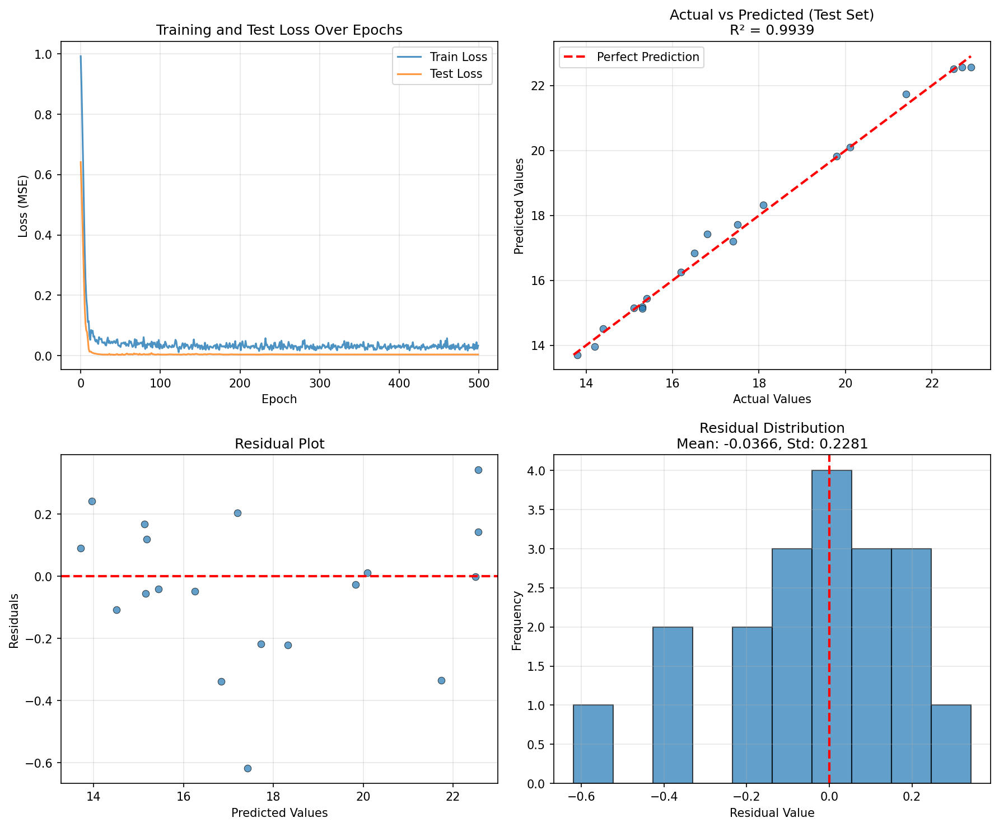
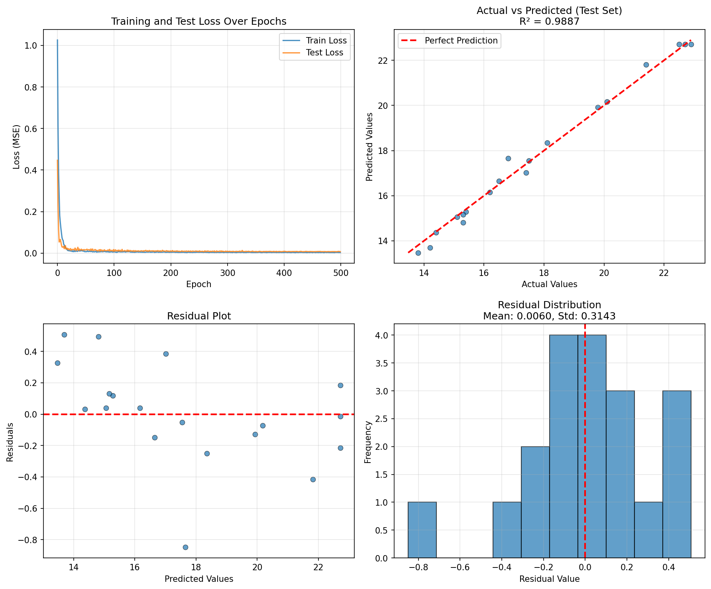

# Regression Models with PyTorch

PyTorch를 활용한 회귀 모델 프로젝트. 동일한 데이터셋에 대해 MLP와 Transformer 두 가지 접근 방식을 구현하고 비교한다.

## Project Structure

```
MLP_ex/
├── regression_data.csv          # Training dataset (96 samples, 4 features)
├── mlp_regression.py            # MLP training script
├── mlp_model.pth                # MLP saved model
├── mlp_results.png              # MLP performance visualization
├── transformer_regression.py    # Transformer training script
├── transformer_model.pth        # Transformer saved model
├── transformer_results.png      # Transformer performance visualization
└── README.md
```

## Dataset

- **Samples**: 96개
- **Features**: feature1, feature2, feature3, feature4 (4개)
- **Target**: 연속값 (11.4 ~ 24.6)
- **Split**: Train 80% / Test 20% (random_state=42)
- **Preprocessing**: StandardScaler (features, target 각각 정규화)

## Requirements

- Python 3.8+
- PyTorch
- pandas
- numpy
- matplotlib
- scikit-learn

Install dependencies:
```bash
pip install torch pandas numpy matplotlib scikit-learn
```

## Usage

```bash
python mlp_regression.py
python transformer_regression.py
```

---

## 1. MLP (Multi-Layer Perceptron)

### Architecture

```
Input (4 features) → Dense(64) → ReLU → Dropout(0.1)
                   → Dense(32) → ReLU → Dropout(0.1)
                   → Dense(16) → ReLU → Dropout(0.1)
                   → Dense(1) → Output
```

- **Parameters**: ~3K
- **Optimizer**: Adam (lr=0.001, weight_decay=1e-5)
- **Scheduler**: ReduceLROnPlateau (factor=0.5, patience=50)
- **Epochs**: 500

### Performance

| Metric | Training | Test |
|--------|----------|------|
| MSE    | 0.0434   | 0.0534 |
| RMSE   | 0.2083   | 0.2310 |
| MAE    | 0.1565   | 0.1753 |
| R²     | 0.9969   | 0.9939 |

### Results



---

## 2. Transformer (TabTransformer)

### Architecture

각 feature를 개별 token으로 취급하는 TabTransformer 방식을 적용하였다.

```
Input (4 features, each as a token)
  → Feature Embedding (1 → 32)
  → Positional Embedding (learnable)
  → Transformer Encoder (2 layers, 4 heads, ff=64)
  → Mean Pooling
  → Dense(16) → ReLU → Dense(1) → Output
```

- **Parameters**: 17,825
- **d_model**: 32, **nhead**: 4, **num_layers**: 2
- **Optimizer**: Adam (lr=0.001, weight_decay=1e-5)
- **Scheduler**: ReduceLROnPlateau (factor=0.5, patience=50)
- **Epochs**: 500

### Performance

| Metric | Training | Test |
|--------|----------|------|
| MSE    | 0.0325   | 0.0988 |
| RMSE   | 0.1803   | 0.3143 |
| MAE    | 0.1410   | 0.2319 |
| R²     | 0.9977   | 0.9887 |

### Results



---

## 3. Model Comparison

### Test Set Performance

| Metric | MLP | Transformer | Winner |
|--------|-----|-------------|--------|
| MSE    | **0.0534** | 0.0988 | MLP |
| RMSE   | **0.2310** | 0.3143 | MLP |
| MAE    | **0.1753** | 0.2319 | MLP |
| R²     | **0.9939** | 0.9887 | MLP |
| Parameters | **~3K** | 17,825 | MLP |

### Analysis

- **MLP**가 모든 test 지표에서 Transformer보다 우수한 성능을 보인다.
- Transformer는 train R²(0.9977)이 MLP(0.9969)보다 높지만, test에서는 역전되어 약간의 overfitting 경향이 있다.
- 이는 데이터셋의 특성에 기인한다:
  - **소규모 데이터** (96 samples): Transformer는 self-attention 학습에 충분한 데이터가 필요하며, 소규모 데이터에서는 MLP가 유리하다.
  - **단순한 feature 관계**: feature와 target 간 관계가 비교적 선형적이어서, 복잡한 feature 간 상호작용을 학습하는 Transformer의 장점이 부각되지 않는다.
  - **파라미터 효율성**: MLP는 ~3K 파라미터로 충분히 학습하는 반면, Transformer는 17,825개 파라미터로 오히려 과적합 위험이 크다.
- Transformer는 대규모 데이터, 복잡한 feature 간 상호작용이 존재하는 경우에 더 큰 강점을 발휘할 수 있다.
